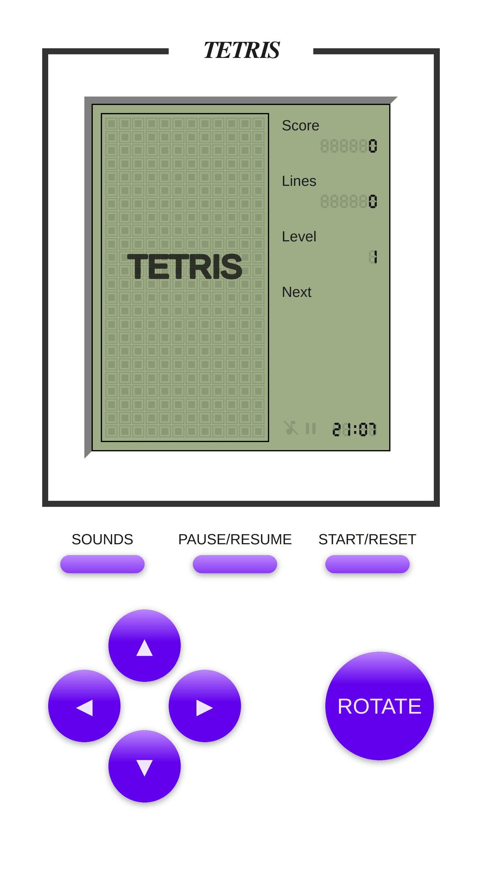
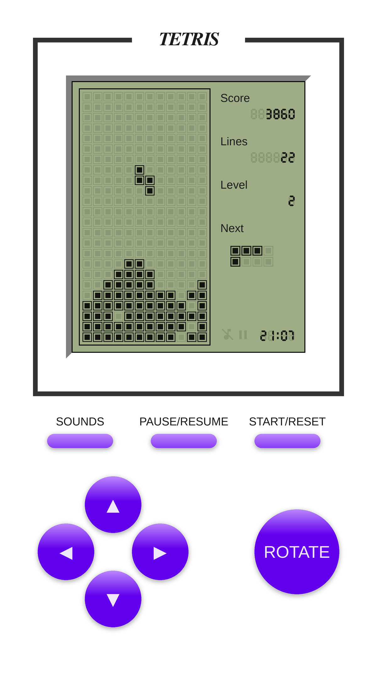
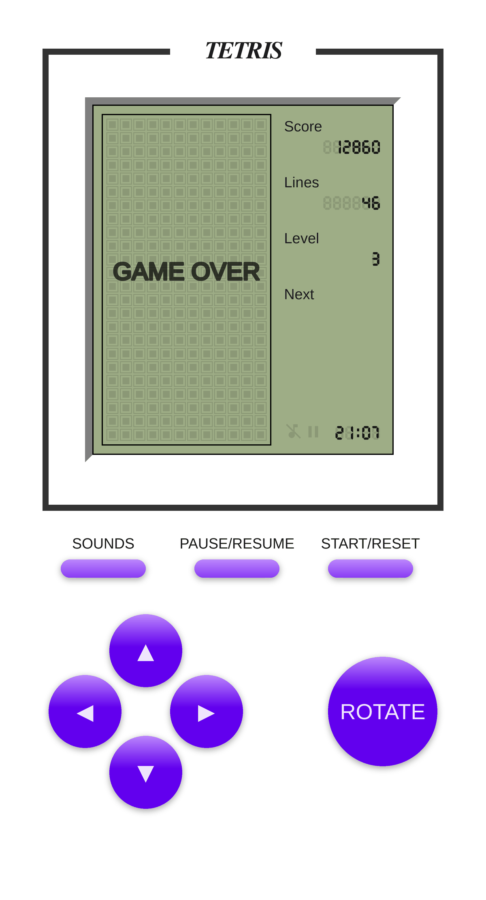
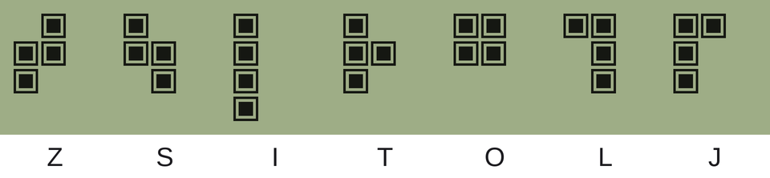

# Compose Tetris

A complete Tetris game for Android, written from scratch in **Kotlin** and **Jetpack Compose** —
no game engine, no `View` system. Every brick, the LED scoreboard and the plastic-handheld body are
drawn on a Compose `Canvas`, and the whole game runs off a single immutable state object driven by
a coroutine game loop.

<p align="left">
  
  
  
  
</p>

---

## 📸 Screens

<table>
  <tr>
    <td align="center"></td>
    <td align="center"></td>
    <td align="center"></td>
    <td align="center"></td>
  </tr>
  <tr>
    <td align="center"><b>Onboard</b><br>press START to play</td>
    <td align="center"><b>Running</b><br>score, lines, level, next</td>
    <td align="center"><b>Paused &amp; muted</b><br>both LED icons light up</td>
    <td align="center"><b>Game over</b><br>after the screen wipe</td>
  </tr>
</table>

> These images are rendered directly from the Compose UI code — same colours, geometry, LED font and
> piece logic — by [`docs/tools/render_ui.py`](docs/tools/render_ui.py), so they stay accurate
> without a device in the loop. To replace them with real device captures:
> `adb exec-out screencap -p > docs/screenshots/02-gameplay.png`.

---

## ✨ Features

- **Retro LED handheld look** — the body, bevelled screen frame, brand plate and the dot-matrix
  bricks are all drawn in Compose; the scoreboard uses a real 7-segment LED typeface
  (`res/font/unidream_led.ttf`).
- **Full 12 × 24 playfield** with a next-piece preview, score, line counter and level readout.
- **Seven-piece bag** — all 7 tetrominoes are shuffled and dealt before the bag refills, so you
  never get a long drought of the piece you need.
- **Hard drop** — the ▲ button slams the piece straight down instead of nudging it up.
- **Auto-repeat controls** — hold ◀ ▶ ▼ and the button keeps firing (300 ms delay, then every 60 ms).
- **Ten speed levels** — the gravity tick shortens from 650 ms to 155 ms as you clear lines.
- **Line-clear and screen-wipe animations**, driven by the same state machine as the game itself.
- **Sound effects** for move, rotate, drop, line clear and start, with a mute toggle.
- **Lifecycle aware** — the game pauses itself when the app goes to the background and resumes when
  you come back.
- **Live LED clock** in the corner of the screen, exactly like the handhelds this apes.

---

## 🎮 How to play

| Button | Action | Notes |
| --- | --- | --- |
| ◀ / ▶ | Move left / right | Auto-repeats while held |
| ▼ | Soft drop (one row) | Auto-repeats while held |
| ▲ | **Hard drop** | Drops the piece to the floor instantly |
| `ROTATE` | Rotate 90° clockwise | Kicks back inside the walls if it would overhang |
| `SOUNDS` | Mute / unmute | The 🎵 icon on screen lights up when muted |
| `PAUSE/RESUME` | Pause or resume | The ⏸ icon on screen lights up when paused |
| `START/RESET` | Start a game, or wipe the board | From *Onboard* / *Game over* it starts; mid-game it plays the screen-wipe and returns to *Onboard* |

### Scoring

| Event | Points |
| --- | --- |
| Piece locked into the stack | **12** |
| 1 line cleared | **100** |
| 2 lines cleared | **300** |
| 3 lines cleared | **700** |
| 4 lines cleared (a *Tetris*) | **1500** |

### Levels and speed

`level = min(10, 1 + lines / 20)` — so a new level every 20 lines, capped at 10.
Gravity interval is `650 ms − 55 ms × (level − 1)`:

| Level | 1 | 2 | 3 | 4 | 5 | 6 | 7 | 8 | 9 | 10 |
| --- | --- | --- | --- | --- | --- | --- | --- | --- | --- | --- |
| Tick (ms) | 650 | 595 | 540 | 485 | 430 | 375 | 320 | 265 | 210 | 155 |
| Lines | 0 | 20 | 40 | 60 | 80 | 100 | 120 | 140 | 160 | 180+ |

The game ends when a freshly spawned piece has nowhere to go: the board wipes itself row by row and
`GAME OVER` blinks over the empty matrix.

### The pieces



All seven are defined as four `Offset`s in `logic/TetrisSpirits.kt` and rotated with a plain
90° transform, `(x, y) → (y, −x)`, followed by an offset adjustment that pushes the piece back
inside the walls (a simple wall kick).

---

## 🏗️ How it works

The game is a small unidirectional-data-flow loop. Composables render a single immutable
`ViewState` and send `Action`s back; nothing else holds game state.

```
     ┌──────────────────────────────────────────────┐
     │                                              │
  Action ──► GameViewModel.reduce() ──► ViewState ──┴──► StateFlow ──► GameScreen (Canvas)
     ▲                                                                       │
     └──────────────── button taps / game tick / lifecycle ──────────────────┘
```

- **`Action`** — `Move`, `Rotate`, `Drop`, `GameTick`, `Pause`, `Resume`, `Reset`, `Mute`.
- **`ViewState`** — the bricks already on the board, the falling piece, the reserve bag, matrix size,
  status, score, lines and mute flag. `level`, `tetrisSpiritsNext`, `isRunning` and `isPaused` are
  derived properties, so they can never drift out of sync.
- **`GameStatus`** — `Onboard → Running ⇄ Paused`, plus the transient `LineClearing` and
  `ScreenClearing` animation states and the terminal `GameOver`.
- **The game loop** is a coroutine in `viewModelScope` that dispatches `GameTick` on an interval
  derived from the current level; reductions run on `Dispatchers.Default`.
- **Collision** is a pure function: `TetrisSpirits.isValidInMatrix()` checks the piece's cells
  against the walls, the floor and the settled bricks.
- **Line clearing** returns three brick lists — before, cleared-but-not-collapsed, and collapsed —
  so the flashing animation and the final board come from the same computation.

### Source map

| File | What lives there |
| --- | --- |
| `MainActivity.kt` | Compose entry point, lifecycle observer, button → `Action` wiring |
| `logic/GameViewModel.kt` | `ViewState`, `Action`, the reducer, the tick loop, line clearing |
| `logic/TetrisSpirits.kt` | Piece shapes, rotation, wall kicks, validity checks, the 7-piece bag |
| `logic/Brick.kt` | A settled cell on the board |
| `logic/Utils.kt` | Directions, scoring, `SoundPool` helper, LED font, status-bar helper |
| `ui/theme/TetrisGameBody.kt` | The handheld body: screen bezel, setting buttons, D-pad, rotate |
| `ui/theme/TetrisScreen.kt` | The LCD: matrix, bricks, next-piece preview, scoreboard, overlay text |
| `ui/theme/ControlButtons.kt` | `GameButton` with ripple, gradient and press-and-hold auto-repeat |
| `ui/theme/LedNo.kt` | 7-segment number rendering and the LED clock |
| `ui/theme/Color.kt`, `Theme.kt`, `Type.kt`, `Shapes.kt` | Material 3 theme and the LCD palette |

---

## 🛠️ Built with

- **Kotlin** 1.9.0
- **Jetpack Compose** (BOM 2024.04.01, Material 3, compiler extension 1.5.1)
- **Coroutines & `StateFlow`** for the game loop and state
- **ViewModel** + `collectAsStateWithLifecycle()`
- **`SoundPool`** for low-latency sound effects
- **Android Gradle Plugin** 8.5.2, Gradle wrapper included

---

## 📦 Getting started

### Prerequisites

- Android Studio Koala (2024.1) or newer — AGP 8.5.2
- **JDK 17** or newer
- Android SDK Platform 34 (`compileSdk`/`targetSdk` 34)
- A device or emulator running **Android 7.0 (API 24)** or newer

### Clone and run

```bash
git clone https://github.com/Misbah542/TetrisGame.git
cd TetrisGame
```

Open the folder in Android Studio and hit ▶, or build from the command line:

```bash
./gradlew assembleDebug      # APK -> app/build/outputs/apk/debug/
./gradlew installDebug       # build and install on the connected device
./gradlew test               # unit tests
./gradlew connectedAndroidTest   # instrumented tests (device/emulator required)
```

### Project layout

```
app/src/main/
├── java/com/misbahminiproject/tetris/
│   ├── MainActivity.kt
│   ├── logic/            # game rules, state, sound
│   └── ui/theme/         # all Compose UI and drawing
└── res/
    ├── font/unidream_led.ttf     # 7-segment LED typeface
    ├── raw/                      # move, rotate, drop, clean, start sounds
    └── drawable/                 # pause / music-off indicators
docs/
├── screenshots/          # images used in this README
└── tools/render_ui.py    # regenerates those images from the Compose source
```

### Regenerating the screenshots

```bash
pip install pillow
python3 docs/tools/render_ui.py docs/screenshots
```

---

## 🧭 Ideas for contributions

- Ghost piece showing where the current tetromino will land
- Hold/swap slot
- High-score persistence (DataStore)
- Haptics on lock and line clear
- Landscape and tablet layouts, plus hardware-keyboard support
- Unit tests for the reducer: rotation kicks, line collapse, scoring

---

## 🤝 Contributing

Issues and pull requests are welcome. For anything larger than a fix, open an issue first so the
change can be discussed.

---

Built with ❤️ by [Misbah](https://github.com/misbahhaque)
